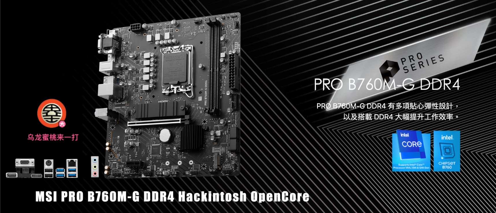

## MSI PRO B760M-G DDR4 Hackintosh OpenCore EFI



### [简体中文](README.zh_CN.md)

[OpenCore 0.9.6](https://github.com/acidanthera/OpenCorePkg)


### macOS

- Ventura
- Monterey
- Sonoma


### Spec

- Chipset: B760
- CPU: Intel 13th i5-13400
- Memo: Kingston Fury 32GB DDR4 3600Mhz
- SSD: Samsung SSD 860 EVO 250GB Windows
- SSD: WD BLACK SN770 2TB MacOS
- iGPU: Intel UHD Graphic 730 (Only work in Windows)
- GPU: Sapphire Radeon RX580 8GB GDDR5 2304SP
- HDA: Realtek ALC897
- LAN: Realtek RTL8125 Gaming  2.5GbE


### BIOS

```
Settings
  |-- Security
     |-- Secure Boot
       |-- Secure Boot: Disabled
       
Search
  |-- D.T.M
    |-- D.T.M: Enabled
```


### Notes

 - Use [OpenCore Configurator](https://mackie100projects.altervista.org/opencore-configurator/) or [OCAuxiliaryTools](https://github.com/ic005k/OCAuxiliaryTools) build your SMBIOS
 - To use a CPU without Efficient-core, the Kernel - ProvideCurrentCpuinfo option in the configuration file must be unchecked


### Tools

- [Hackintool](https://github.com/headkaze/Hackintool) 
- [OCAuxiliaryTools](https://github.com/ic005k/OCAuxiliaryTools) AKA `OCAT`.
- [OpenCore Configurator](https://mackie100projects.altervista.org/opencore-configurator/) AKA `OCC`.
- [gibMacOS](https://github.com/corpnewt/gibMacOS) Build your own MacOS image.
- [ProperTree](https://github.com/corpnewt/ProperTree) Plist editor.


### Contact Us

QQ Group: 23304408


