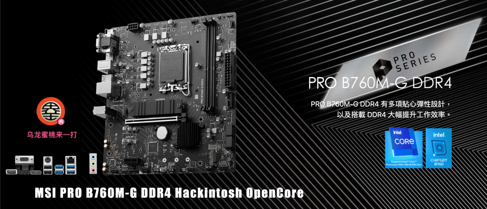
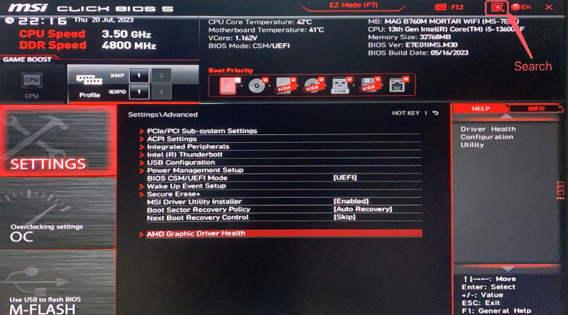
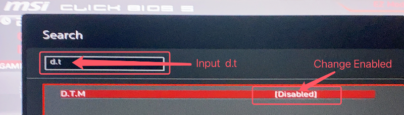
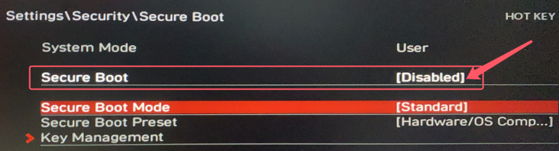

## MSI PRO B760M-G DDR4 黑苹果 OpenCore EFI



### [ENGLISH](https://github.com/hackintosh-club/MAG-B760M-MORTAR-OpenCore)

[OpenCore 0.9.7](https://github.com/acidanthera/OpenCorePkg)


### macOS

- Monterey
- Ventura
- Sonoma


### 硬件

- 芯片组: B760
- 处理器: 英特尔13代 i5-13400
- 内   存:  金士顿 Fury 32GB DDR4 3600Mhz
- 硬   盘:  三星 SSD 860 EVO 250GB Windows
- 硬   盘:  西数 BLACK SN770 2TB MacOS
- 核   显:  英特尔超核心显卡730 (仅能在 Windows中使用)
- 显   卡:  蓝宝石 Radeon RX580 8GB GDDR5 2304SP
- 声   卡:  瑞昱 ALC897
- 有线网卡: 瑞昱 RTL8125 Gaming 2.5GbE


### BIOS设置

```
1.关闭安全启动
Settings
  |-- Security
     |-- Secure Boot
       |-- Secure Boot: Disabled

2.使用搜索功能查找并启用 D.T.M 
Search
  |-- D.T.M
    |-- D.T.M: Enabled

```








### 注意事项

 - 安装成功后必须使用 [OpenCore Configurator](https://mackie100projects.altervista.org/opencore-configurator/) 或者 [OCAuxiliaryTools](https://github.com/ic005k/OCAuxiliaryTools) 生成你自己的 SMBIOS
 - 如需使用没有小核心的CPU，必须取消勾选配置文件中Kernel--ProvideCurrentCpuinfo选项


### 常用工具

- [Hackintool](https://github.com/headkaze/Hackintool) 
- [OCAuxiliaryTools](https://github.com/ic005k/OCAuxiliaryTools) AKA `OCAT`.
- [OpenCore Configurator](https://mackie100projects.altervista.org/opencore-configurator/) AKA `OCC`.
- [gibMacOS](https://github.com/corpnewt/gibMacOS) Build your own MacOS image.
- [ProperTree](https://github.com/corpnewt/ProperTree) Plist editor.


### 联系我们

QQ Group: 23304408


